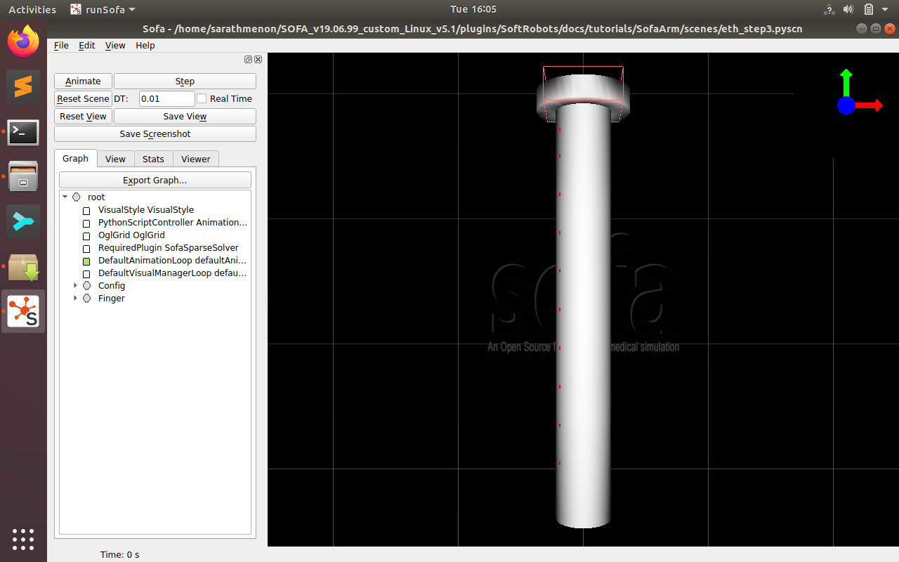

# Soft Manipulator

Ros package for the three segment soft robotic manipulator

<p align="center">
		
</p>


 ## Installing ROS

 Instructions for installing ROS Melodic in Ubuntu 18.04: http://wiki.ros.org/melodic/Installation/Ubuntu
 Instruction for creating catkin_ws: http://wiki.ros.org/catkin/Tutorials/create_a_workspace
 
 ```
 cd catkin_ws/src
 git clone https://github.com/sarath-menon/soft_manipulator.git
 cd ..
 catkin_make
```

 ## Installing the SOFA simulator

Website: https://www.sofa-framework.org/download/

After downloading, move the folder SoftArm to 'SOFA_v19.06.99_custom_Linux_v5.1/plugins/SoftRobots/docs/tutorials'

 ## Running the example

The example consists of a soft robotic arm which can be manipualted with mouse interaction. The pose of the manipulator tip is published on the topic "softarm/pose"

1. Run the SOFA simulator and open 'eth_scene4.pyscn'
2. In the terminal window run: 

 ```
 roslaunch soft_arm receiver.launch
 ```


